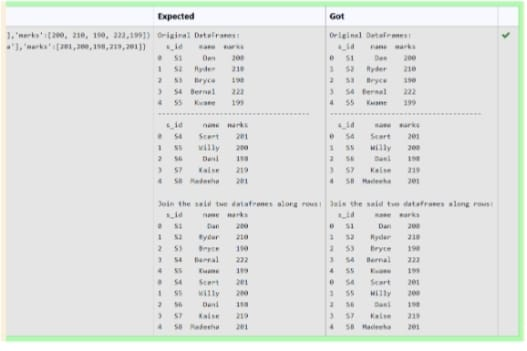

# 🧪 Pandas Program: Join Two DataFrames Along Rows

## 🎯 AIM

To write a Python program using Pandas to **join two DataFrames along rows** (row-wise concatenation) and assign all data to a new DataFrame.

---

## 🧠 ALGORITHM

1. **Import Libraries**: Import the `pandas` library.
2. **Create First DataFrame**: Use a dictionary to create `student_data1`.
3. **Create Second DataFrame**: Use another dictionary to create `student_data2`.
4. **Concatenate DataFrames**: Use `pd.concat()` with `axis=0` to concatenate both DataFrames row-wise.
5. **Display Result**: Print the new combined DataFrame.

---

## 💻 Program
```
import pandas as pd
a=eval(input())
b=eval(input())
df1=pd.DataFrame(a)
df2=pd.DataFrame(b)
print("Original DataFrames:")
print(df1)
print("-------------------------------------")
print(df2)
print()
mer=pd.concat([df1,df2])
print("Join the said two dataframes along rows:")
print(mer)
```

## Output

## Result
A Python program using Pandas to **join two DataFrames along rows** (row-wise concatenation) and assign all data to a new DataFrame was completed successfully and output was generated.

